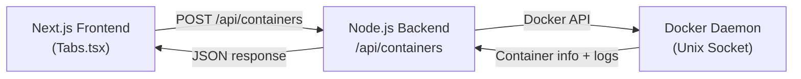

# Backend-Docker Integration Guide

## Overview

This document explains how to connect the Dockerverse webapp to a local Docker daemon for managing containers and images in a self-hosted environment.

---

## Question: Can We Connect to Local Docker?

**Yes, absolutely.** A self-hosted webapp can connect to the local Docker daemon to list containers, images, and launch new ones. There are several approaches, each with trade-offs in complexity and security.

---

## Integration Approaches

### 1. **Docker Socket (Recommended for Self-Hosting)**

**What it is:** Access Docker via `/var/run/docker.sock` (Unix) or `\\.\pipe\docker_engine` (Windows).

**How it works:**
- Your backend (Node/Express, Go, etc.) runs on the same host as Docker.
- The backend process has read/write access to the Docker socket.
- Direct API calls to Docker via the socket (no network overhead).

**Pros:**
- ✅ Fastest (local socket communication).
- ✅ No exposed ports or network services.
- ✅ Simplest to set up for local self-hosting.
- ✅ Full Docker API access.

**Cons:**
- ❌ Requires backend and Docker on the same machine.
- ❌ Requires proper file permissions (usually `docker` group).

**Security Considerations:**
- Access to the Docker socket is **powerful**—anyone who can read/write it can spawn containers as root.
- Only run trusted applications with socket access.
- On production, use apparmor/SELinux to restrict socket access.

**Backend Example (Node.js + Docker API Library):**

```javascript
// Using dockerode library
const Docker = require("dockerode");
const docker = new Docker({ socketPath: "/var/run/docker.sock" });

// List containers
docker.listContainers({ all: true }, (err, containers) => {
  console.log(containers);
});

// Create a container
docker.createContainer(
  { Image: "alpine", Cmd: ["echo", "hello"] },
  (err, container) => {
    container.start((err) => {
      console.log("Container started");
    });
  }
);
```

**Frontend Integration (Next.js):**

```typescript
// src/api/containers.ts - API route handlers
export async function getContainers() {
  const response = await fetch("/api/containers");
  return response.json(); // Returns list of containers with status, logs, ports
}

export async function createContainer(config: {
  image: string;
  name: string;
  ports?: string[];
}) {
  const response = await fetch("/api/containers", {
    method: "POST",
    body: JSON.stringify(config),
  });
  return response.json(); // Returns new container info + logs
}

export async function deleteContainer(containerId: string) {
  const response = await fetch(`/api/containers/${containerId}`, {
    method: "DELETE",
  });
  return response.json();
}

export async function getContainerLogs(containerId: string) {
  const response = await fetch(`/api/containers/${containerId}/logs`);
  return response.text(); // Stream logs or return tail
}
```

---

### 2. **Docker TCP Socket (Remote Docker)**

**What it is:** Access Docker via TCP (e.g., `tcp://localhost:2375` or `tcp://192.168.1.100:2375`).

**How it works:**
- Docker daemon exposes a TCP API endpoint.
- Backend connects over the network.

**Pros:**
- ✅ Works remotely (backend ≠ Docker host).
- ✅ Scales to multiple Docker hosts.

**Cons:**
- ❌ Less secure (exposed TCP = potential attack surface).
- ❌ Requires TLS/mTLS for production (certificate management overhead).
- ❌ Network latency vs. socket.

**Security Considerations:**
- **NEVER expose Docker TCP on unsecured networks.** Always use TLS with mutual authentication.
- Requires client certificates and CA validation.
- Suitable for private networks or VPNs only.

**Setup Example (with TLS):**

```bash
# On Docker host, enable TCP with TLS (systemd)
# /etc/docker/daemon.json
{
  "tls": true,
  "tlscert": "/path/to/cert.pem",
  "tlskey": "/path/to/key.pem",
  "listen": ["unix:///var/run/docker.sock", "tcp://0.0.0.0:2376"]
}
```

**Backend (Node.js):**

```javascript
const Docker = require("dockerode");
const fs = require("fs");

const docker = new Docker({
  host: "192.168.1.100",
  port: 2376,
  ca: fs.readFileSync("/path/to/ca.pem"),
  cert: fs.readFileSync("/path/to/cert.pem"),
  key: fs.readFileSync("/path/to/key.pem"),
});
```

---

### 3. **Docker Desktop (Windows/macOS)**

**What it is:** Use Docker Desktop's built-in socket or TCP endpoint.

**How it works:**
- Docker Desktop exposes a socket/pipe for local apps.
- Backend connects via the exposed path.

**Windows:**
```javascript
const Docker = require("dockerode");
const docker = new Docker({ socketPath: "\\.\pipe\docker_engine" });
```

**macOS:**
```javascript
const Docker = require("dockerode");
const docker = new Docker({
  socketPath: "/var/run/docker.sock", // Shared with Docker Desktop
});
```

---

### 4. **Docker Compose / Orchestration**

**What it is:** Use a dedicated service (sidecar) to expose Docker API via HTTP.

**How it works:**
- Deploy a simple HTTP wrapper around the Docker socket.
- Backend calls HTTP endpoints instead of Docker API directly.

**Example (using `docker-socket-proxy`):**

```yaml
version: "3"
services:
  docker-proxy:
    image: tecnativa/docker-socket-proxy
    environment:
      CONTAINERS: 1
      IMAGES: 1
      NETWORKS: 1
    volumes:
      - /var/run/docker.sock:/var/run/docker.sock
    ports:
      - "2375:2375"

  app:
    image: my-app
    depends_on:
      - docker-proxy
    environment:
      DOCKER_HOST: "tcp://docker-proxy:2375"
```

---

## Required Backend Permissions

For the backend to manage Docker resources, it needs:

1. **Read permissions:** List containers, images, view logs.
2. **Write permissions:** Create/delete containers, manage images.
3. **Socket access:** Ability to communicate with Docker daemon.

**Linux setup (Docker socket):**

```bash
# Ensure backend process user is in docker group
sudo usermod -aG docker $USER
# Or run backend with sudo (not recommended for security)
```

**Permission Matrix:**

| Operation | Required API | Permission |
|-----------|--------------|-----------|
| List containers | `GET /containers/json` | Socket read |
| Get container logs | `GET /containers/{id}/logs` | Socket read |
| Create container | `POST /containers/create` | Socket write |
| Start container | `POST /containers/{id}/start` | Socket write |
| Stop container | `POST /containers/{id}/stop` | Socket write |
| Delete container | `DELETE /containers/{id}` | Socket write |
| List images | `GET /images/json` | Socket read |
| Delete image | `DELETE /images/{id}` | Socket write |

---

## Frontend-to-Backend Flow



---

## API Contract Example

### Containers API

**GET `/api/containers`** — List all containers

```json
{
  "containers": [
    {
      "id": "abc123def456",
      "name": "my-app",
      "image": "node:18",
      "status": "running",
      "createdAt": 1699700000000,
      "ports": ["8080:3000", "5432:5432"]
    }
  ]
}
```

**POST `/api/containers`** — Create a container

```json
Request: {
  "image": "node:18",
  "name": "my-app",
  "ports": ["8080:3000"]
}

Response: {
  "id": "abc123def456",
  "name": "my-app",
  "status": "initializing",
  "logs": ["[init] pulling image...", "[init] creating container..."]
}
```

**GET `/api/containers/{id}/logs`** — Stream logs (Server-Sent Events or WebSocket)

```text
[init] pulling image...
[init] starting container...
[info] server listening on port 3000
```

**DELETE `/api/containers/{id}`** — Delete container

```json
Response: { "success": true, "id": "abc123def456" }
```

### Images API

**GET `/api/images`** — List images

```json
{
  "images": [
    {
      "id": "sha256:abc123...",
      "name": "node",
      "tags": ["18", "latest", "18-alpine"]
    }
  ]
}
```

**DELETE `/api/images/{id}/tags/{tag}`** — Delete image tag

**DELETE `/api/images/{id}`** — Delete entire image

---

## Recommended Tech Stack

**Backend:**
- **Node.js + Express**: Simple, fast, good Docker library support (`dockerode`).
- **Go**: High performance, native Docker SDK support.
- **Python**: Good for scripting, docker-py library.

**Libraries:**
- **Node.js**: `dockerode`, `docker-cli-js`
- **Python**: `docker` (official SDK)
- **Go**: `moby/moby` (Docker client library)

---

## Security Best Practices

1. **Principle of Least Privilege**
   - Backend only gets permissions it needs.
   - Don't run backend as root unless absolutely necessary.

2. **Socket Permissions**
   - On Linux, restrict socket to specific user/group.
   - Use AppArmor/SELinux profiles to sandbox the backend.

3. **Network Isolation**
   - If using TCP, keep Docker daemon on private network only.
   - Use VPN/SSH tunnels for remote access.
   - Always enable TLS with mutual authentication.

4. **API Rate Limiting**
   - Limit frontend requests to avoid DOS.
   - Implement timeouts on long-running operations.

5. **Audit & Logging**
   - Log all container creation/deletion.
   - Monitor Docker socket access.

6. **Container Resource Limits**
   - Always set memory/CPU limits on created containers.
   - Prevent runaway containers from crashing the host.

---

## Example: Full Node.js Backend Setup

```javascript
// backend/routes/containers.js
const express = require("express");
const Docker = require("dockerode");

const router = express.Router();
const docker = new Docker({ socketPath: "/var/run/docker.sock" });

// GET /api/containers
router.get("/", async (req, res) => {
  try {
    const containers = await docker.listContainers({ all: true });
    const data = containers.map((c) => ({
      id: c.Id,
      name: c.Names[0],
      image: c.Image,
      status: c.State,
      ports: c.Ports.map((p) => `${p.PublicPort}:${p.PrivatePort}`),
      createdAt: c.Created * 1000,
    }));
    res.json({ containers: data });
  } catch (err) {
    res.status(500).json({ error: err.message });
  }
});

// POST /api/containers
router.post("/", async (req, res) => {
  try {
    const { image, name, ports } = req.body;
    const portConfig = {};
    const hostConfig = {};

    ports?.forEach((port) => {
      const [hostPort, containerPort] = port.split(":");
      portConfig[`${containerPort}/tcp`] = {};
      hostConfig.PortBindings = {
        [`${containerPort}/tcp`]: [{ HostPort: hostPort }],
      };
    });

    const container = await docker.createContainer({
      Image: image,
      name: name,
      ExposedPorts: portConfig,
      HostConfig: hostConfig,
    });

    await container.start();
    const data = await container.inspect();

    res.json({
      id: data.Id,
      name: data.Name,
      status: "running",
      logs: ["[init] container created and started"],
    });
  } catch (err) {
    res.status(500).json({ error: err.message });
  }
});

// DELETE /api/containers/:id
router.delete("/:id", async (req, res) => {
  try {
    const container = docker.getContainer(req.params.id);
    await container.stop();
    await container.remove();
    res.json({ success: true, id: req.params.id });
  } catch (err) {
    res.status(500).json({ error: err.message });
  }
});

module.exports = router;
```

---

## Summary

| Approach | Self-Hosting | Remote | Security | Complexity |
|----------|--------------|--------|----------|-----------|
| Docker Socket | ✅ Best | ❌ | ✅ High | Low |
| Docker TCP + TLS | ✅ Good | ✅ | ✅ Medium | Medium |
| Docker Desktop | ✅ Best | ❌ | ✅ High | Low |
| Socket Proxy | ✅ Good | ✅ | ⚠️ Medium | Medium |

**Recommendation for self-hosting:** Use **Docker Socket** approach with proper permission management. It's the simplest, fastest, and most secure for local deployment.

---

## Next Steps

1. Set up backend routes (see example above).
2. Update frontend API calls in `Tabs.tsx` to fetch real data.
3. Implement container creation form with image/port selection.
4. Add real-time log streaming (WebSocket or SSE).
5. Add delete functions for containers and images.
